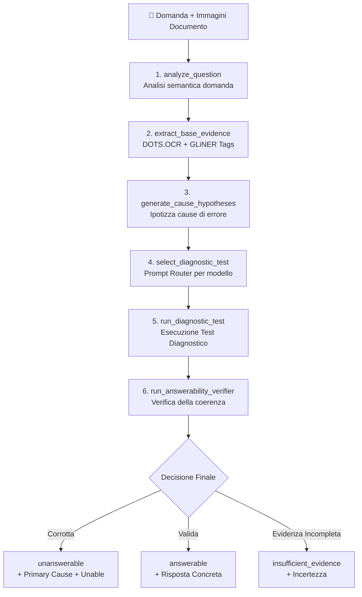
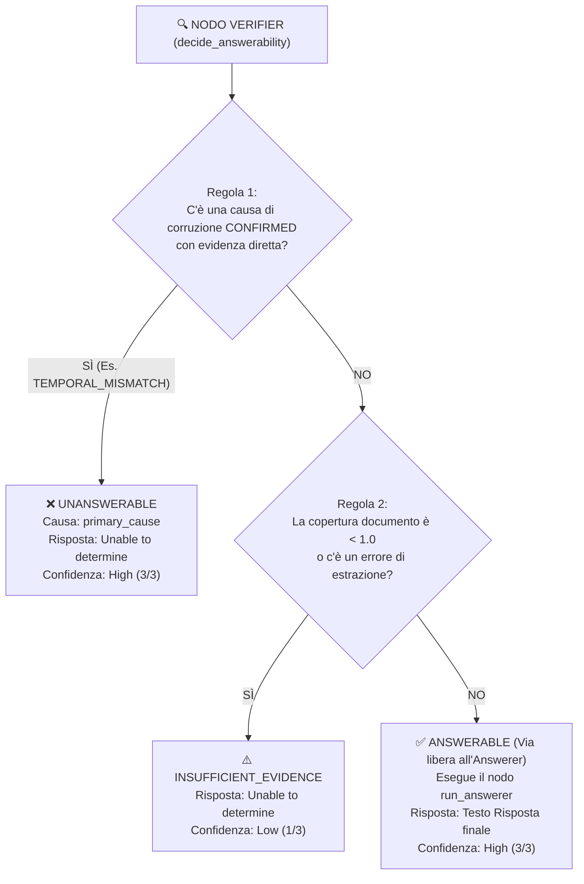

Agentic-VQA-Pipeline# Spiegazione del Funzionamento dell'Unanswerability Diagnostic Agent

Questo documento illustra nel dettaglio l'architettura, le fasi operative, la logica di routing, il funzionamento del Verifier e fornisce un esempio pratico dell'**Unanswerability Diagnostic Agent** basato su **LangGraph**.

---

## 1. Architettura Generale e Processo Diagnostico

L'**Unanswerability Diagnostic Agent** è progettato come un **investigatore forense per documenti**. Invece di chiamare direttamente un modello VLM per rispondergli o chiedergli genericamente se la domanda è valida, l'agente esegue un **processo diagnostico strutturato a stati finiti (LangGraph)**.

### Grafo Operativo dell'Agente (`graph.py`)



---

## 2. Le 5 Fasi Spiegate nel Dettaglio

### Fase 1: Analisi della Domanda (`analyze_question`)
L'agente scompone la domanda prima ancora di ispezionare l'immagine del documento:
* **Answer Type**: Rileva se si cerca una persona, una data, un numero, un'organizzazione o una posizione.
* **Entities & Relations**: Identifica le entità chiave e le relazioni richieste.
* **Presupposizioni**: Estrae i vincoli e le premesse implicite contenute nella domanda.

### Fase 2: Estrazione dell'Evidenza Multimodale (`extract_base_evidence`)
Esegue l'estrazione su GPU 0 tramite due modelli specializzati:
1. **DOTS.OCR**: Rileva la struttura visiva e di layout (`[Title]`, `[Table]`, `[Plain Text]`, `[Header]`, `[Figure]`).
2. **GLiNER**: Inserisce tag semantici trasparenti nel testo dell'OCR (es. `<year>2010</year>`, `<price>500 €</price>`, `<person_name>Mario Rossi</person_name>`).

---

### 🔍 Fase 3: Generazione delle Ipotesi e Prompt Router (`generate_cause_hypotheses` & `select_diagnostic_test`)

Il Passo 3 costituisce il **cervello tattico** dell'agente ed agisce in due sotto-fasi principali:

#### 3.1 Generazione ed Ordinamento delle Ipotesi di Causa (`generate_cause_hypotheses`)
Analizzando la scomposizione della domanda ed il testo estratto da DOTS+GLiNER, l'agente genera una **coda di ipotesi causali ordinate per priorità**:
* Se la domanda contiene entità di tipo data/anno $\rightarrow$ Aggiunge l'ipotesi `TEMPORAL_MISMATCH` (Priorità 1).
* Se la domanda contiene cifre, valute o numeri $\rightarrow$ Aggiunge l'ipotesi `VALUE_MISMATCH` (Priorità 2).
* Se la domanda cita posizioni, righe, tabelle o quadranti $\rightarrow$ Aggiunge l'ipotesi `SPATIAL_MISMATCH` (Priorità 3).
* Se la domanda cita nomi propri di persone o aziende assenti nel testo $\rightarrow$ Aggiunge l'ipotesi `ENTITY_MISSING` (Priorità 4).

#### 3.2 Il Meccanismo del Prompt Router (`select_diagnostic_test`)
Il Router applica una logica di **Routing a Due Livelli**:

1. **Model-Aware Routing (Selezione del Profilo per Modello)**:
   Legge dal dizionario `MODEL_PROFILE_MAP` il nome del VLM in uso ed assegna il profilo di prompt ottimizzato:
   - `gemma4:e4b` $\rightarrow$ Profilo **`gemma4_focused`** (utilizza `nlp_list_ocr_cot` come detector ad alto QUR).
   - `gemma3:4b` $\rightarrow$ Profilo **`document_focused`** (utilizza `docel_cot_v4` / `Layout_v1`).
   - `qwen2.5vl:3b` $\rightarrow$ Profilo **`entity_focused`** (utilizza `nlp_tag_cot`).

2. **Cause-Aware Routing (Selezione del Prompt per Causa)**:
   In base alla causa in testa alla coda delle ipotesi, il router seleziona il prompt specifico mappato nel profilo:
   ```python
   # Codice del Router (nodes.py)
   cause = CauseCode(hypotheses[index]["cause"])
   selected_prompt = self.profile.cause_prompts[cause]
   ```
   - Esempio: se la causa è `SPATIAL_MISMATCH`, il router attiva `layout_v4` (prompt multimodale visivo). Se la causa è `ENTITY_MISSING`, attiva `nlp_list_ocr_cot` (confronto tra liste di entità).

---

### 🧪 Fase 4: Esecuzione del Test Diagnostico (`run_diagnostic_test`)

Il Passo 4 è il momento in cui l'agente esegue il test vero e proprio sul modello VLM per raccogliere le prove oggettive.

#### 4.1 Costruzione del Prompt ed Esecuzione a Temperatura 0.0
Il router passa il contesto (`question`, `structured_ocr`, `tagged_ocr`, `cause`, `rationale`) al costruttore del prompt (`spec.builder`). Il modello VLM viene invocato a **temperatura 0.0** per garantire la massima deterministica e riproducibilità.

#### 4.2 Il Contratto di Output JSON per il Test Diagnostico
Il VLM deve rispondere **esclusivamente** con un oggetto JSON strutturato secondo un contratto rigido (`_diagnostic_contract`):

```json
{
  "cause": "TEMPORAL_MISMATCH",
  "status": "confirmed | rejected | undetermined",
  "expected": "valore o data attesa nella domanda",
  "observed": ["valori o date realmente trovate nel documento"],
  "evidence_for": [
    {
      "page": 1,
      "document_element": "Plain Text",
      "quadrant": "Q1",
      "snippet": "frammento esatto del testo che prova il mismatch"
    }
  ],
  "evidence_against": [],
  "confidence": "high | medium | low"
}
```

#### 4.3 Significato degli Stati del Test (`status`):
- **`confirmed`**: L'errore è stato verificato ed è presente un'evidenza diretta di incompatibilità nel documento (`evidence_for`).
- **`rejected`**: L'errore ipotizzato è stato smentito (l'informazione nella domanda è corretta e presente nel documento).
- **`undetermined`**: L'evidenza presente è insufficiente per confermare o smentire l'errore.

---

### ⚖️ Fase 5: Verificatore e Decision Engine (`run_answerability_verifier` & `decide_answerability`)

Il Passo 5 è il **giudice imparziale dell'agente**. Impedisce che un detector o un modello generativo emettano risposte affrettate o allucinazioni.

#### 5.1 Le 3 Regole Deterministiche del Verifier (`nodes.py`)

Il nodo `decide_answerability` valuta lo stato globale dell'agente ed applica 3 regole in ordine di priorità:



1. **Regola 1: Riconoscimento Certo di Corruzione (`unanswerable`)**:
   Se durante i test diagnostici del Passo 4 è stato prodotto un risultato `CONFIRMED` per una causa semantica ed è presente evidenza diretta (`evidence_for`) con copertura documento completa ($\ge 1.0$):
   - **Esito**: `answerability = "unanswerable"`, `primary_cause = <causa>`, `final_answer = "Unable to determine"`, `confidence = 3 (High)`.
   - **Strategia**: L'Answerer **non viene neanche invocato**, azzerando al 100% il rischio di allucinazione.

2. **Regola 2: Incertezza per Limiti di Copertura (`insufficient_evidence`)**:
   Se la domanda non è palesemente corrotta ma la copertura delle pagine è inferiore alla soglia (`evidence_coverage < 1.0`) o si è verificato un errore OCR/GLiNER:
   - **Esito**: `answerability = "insufficient_evidence"`, `final_answer = "Unable to determine"`, `confidence = 1 (Low)`.

3. **Regola 3: Via Libera all'Answering (`answerable`)**:
   In assenza di corruzioni confermate e con copertura documento del 100%, il Verifier invia lo stato al nodo `run_answerer`:
   - L'Answerer genera la risposta concreta sul contesto verificato. Se supportata $\rightarrow$ `answerability = "answerable"`, `final_answer = <testo risposta>`, `confidence = 3 (High)`.

---

## 3. Esempio Pratico Passo-Passo

### Input:
* **Documento**: Un report di bilancio aziendale del **2010** avente testo:  
  `[Plain Text]: In 2010, the company achieved a total revenue of <price>500,000 €</price>.`
* **Domanda Corrotta ricevuta**:  
  *"Qual è stato il fatturato totale registrato nel report del **2015**?"*

### Traccia dell'Esecuzione dell'Agente:

| Passo | Nodo Grafo | Azione ed Esito dell'Agente |
|---|---|---|
| **1** | `analyze_question` | Estrae entità cercata: `<year>2015</year>` e target: `fatturato`. |
| **2** | `extract_base_evidence` | **DOTS+GLiNER** estraggono il testo taggato: `In 2010, total revenue of <price>500,000 €</price>`. L'anno presente è solo `<year>2010</year>`. |
| **3** | `generate_hypotheses` & `select_diagnostic_test` | **Passo 3**: Genera l'ipotesi `TEMPORAL_MISMATCH`. Il Router consulta il profilo e seleziona il prompt `nlp_tag_cot`. |
| **4** | `run_diagnostic_test` | **Passo 4**: Esegue `nlp_tag_cot` a temperatura 0.0.<br/>👉 **Output JSON VLM**: `{ "cause": "TEMPORAL_MISMATCH", "status": "confirmed", "expected": "2015", "observed": ["2010"], "evidence_for": [{"snippet": "In 2010, total revenue of..."}] }` |
| **5** | `run_answerability_verifier` & `decide_answerability` | **Passo 5**: Il Verifier rileva `status: confirmed` con evidenza diretta $\rightarrow$ Applica la **Regola 1** ed emette il verdetto `unanswerable` senza chiamare l'Answerer. |

### Output JSON Finale Prodotto dall'Agente:

```json
{
  "answerability": "unanswerable",
  "primary_cause": "TEMPORAL_MISMATCH",
  "final_answer": "Unable to determine",
  "answerability_confidence": 3,
  "evidence_coverage": 1.0,
  "prompts_used": [
    "question_analysis_v1",
    "nlp_tag_cot",
    "answerability_verifier_v1"
  ],
  "tests_run": 1,
  "steps": 6
}
```

---

## 4. Perché questa Struttura è Efficace

1. **Eliminazione delle Allucinazioni**: Se si facesse la domanda direttamente a un LLM tradizionale, il modello risponderebbe spesso *"500.000 €"*, allucinando che il dato del 2010 si riferisca al 2015. L'agente blocca la risposta evidenziando il disallineamento.
2. **Totale Trasparenza e Spiegabilità**: Non fornisce un "Unable" generico, ma indica l'esatta causa dell'errore (`TEMPORAL_MISMATCH`) e la traccia completa dei passaggi.
