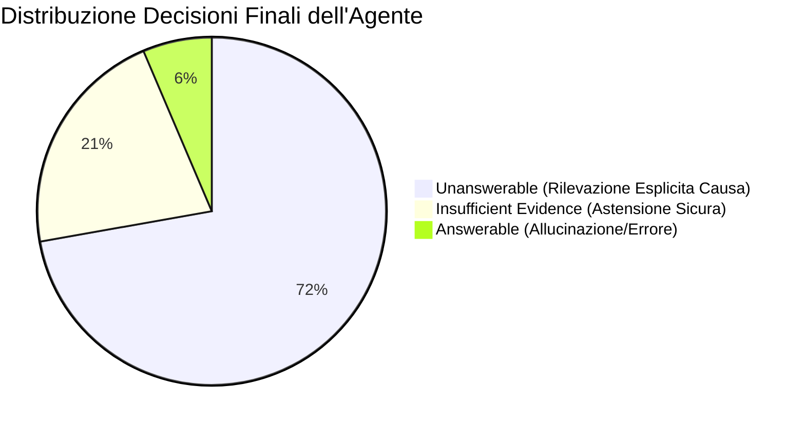
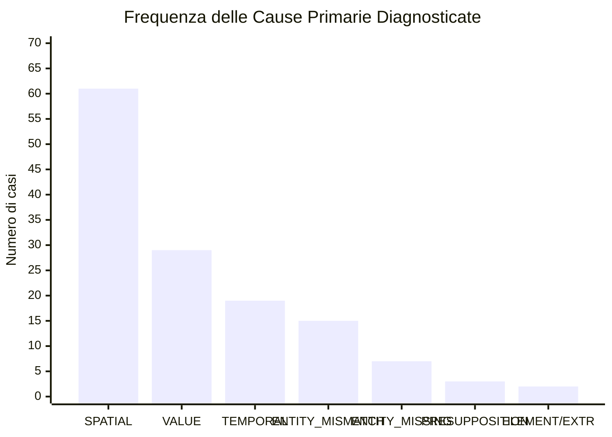

# Report di Analisi dei Risultati: Agentic VQA Pipeline (Gemma 3)

## 1. Introduzione e Metodologia

Il presente documento sintetizza l'analisi quantitativa e qualitativa dei risultati ottenuti dall'**Unanswerability Diagnostic Agent** (basato sul modello **Gemma 3 4B** e architettura **LangGraph**) applicato al benchmark **DUDE** (`DUDE_mixed_test.json`), conservati nella cartella [`Agentic_results`](file:///c:/Tesi/Agentic-VQA-Pipeline/Agentic_results).

A differenza dei modelli VLM a inferenza singola che si limitano a restituire una stringa testuale (risposta o genericamente *"Unable to determine"*), l'agente esegue una diagnosi forense multi-stadio:
1. **Decomposizione della domanda** (`analyze_question`);
2. **Estrazione delle evidenze multimodali** tramite DOTS.OCR e GLiNER (`extract_base_evidence`);
3. **Generazione di ipotesi diagnostiche** (`generate_cause_hypotheses`);
4. **Routing dinamico del prompt** verso probe specializzati (`select_diagnostic_test`);
5. **Esecuzione del test diagnostico** con contratti JSON strutturati (`run_diagnostic_test`);
6. **Verifica deterministica della copertura e decisione finale** (`run_answerability_verifier`).

---

## 2. Panoramica del Dataset e Risultati Globali

Il test completo è stato condotto su **187 domande** del dataset DUDE, tutte appartenenti al sottoinsieme delle domande corrotte/non rispondibili (Ground Truth: 100% unanswerable):

| Metrica | Valore Assoluto | Percentuale | Descrizione / Significato |
| :--- | :---: | :---: | :--- |
| **Domande Totali Elaborate** | **187** | **100.0%** | Domande corrotte valutate sul dataset DUDE |
| ✅ **Classificate `unanswerable` (Strict QUR)** | **135** | **72.19%** | Riconoscimento esatto dell'unanswerability con causa motivata |
| 🛡️ **Classificate `insufficient_evidence` (Safe Abstention)** | **40** | **21.39%** | Astensione preventiva per copertura parziale o OCR ambiguo |
| ❌ **Classificate `answerable` (False Negativi / Allucinazioni)** | **12** | **6.42%** | Risposte allucinate/errate fornite su domande corrotte |
| 🛑 **Unable Rate Totale (UR = Unanswerable + Insufficient)** | **175 / 187** | **93.58%** | **Tasso complessivo di astensione dal fornire risposte errate** |

### Confronto con le Strategie di Prompting Singolo (Gemma 3)
I risultati dell'Agente evidenziano un netto salto qualitativo rispetto ai baseline a prompt singolo testati su Gemma 3:
* **Baseline OCR standard**: QUR = **9.09%** (il modello allucina nel 90%+ dei casi).
* **NLP List**: QUR = **13.37%** (il solo elenco entità non basta a fermare il generatore).
* **DocEl CoT v1 / v4**: QUR = **57.75% / 71.12%** (buona capacità di rilevamento ma privo di categorizzazione della causa e di spiegabilità).
* **Agentic Pipeline**: **Strict QUR = 72.19%**, **Unable Rate = 93.58%** e tasso di allucinazione ridotto al **6.42%**.

---

## 3. Disaggregazione per Livello di Complessità e Prossimità (C1, C2, C3)

La tassonomia VRD-UQA definisce tre classi di corruzione in base alla distanza semantica e geometrica dell'entità alterata:

| Livello di Corruzione | Totale Domande | `unanswerable` (Strict QUR) | `insufficient_evidence` | `answerable` (Allucinazioni) | **Abstention Rate Totale (UR)** |
| :--- | :---: | :---: | :---: | :---: | :---: |
| **C1** (*Same Page, Same Entity Type*) | 114 | **88 (77.19%)** | 18 (15.79%) | 8 (7.02%) | **92.98%** |
| **C2** (*Same Page, Different Entity Type*) | 58 | **37 (63.79%)** | 18 (31.03%) | 3 (5.17%) | **94.83%** |
| **C3** (*Different Page / Out-Page*) | 15 | **10 (66.67%)** | 4 (26.67%) | 1 (6.67%) | **93.33%** |

### 🔍 Considerazioni sui livelli:
1. **Elevata accuratezza su C1 (77.19% QUR)**: La corruzione C1 (stessa pagina, stesso tipo di entità) è storicamente la più insidiosa per i modelli multimodali, poiché la vicinanza dell'entità reale crea un falso contesto locale. L'Agente supera questo bias confrontando le evidenze estratte (GLiNER + DOTS) con i vincoli logici della domanda.
2. **Astensione conservativa su C2 e C3**: Nelle categorie C2 (31.03%) e C3 (26.67%), l'agente ricorre frequentemente alla classe `insufficient_evidence`, garantendo che nei casi di incertezza il sistema preferisca dichiarare dati insufficienti piuttosto che produrre risposte false (allucinazioni confinate a circa il 5-6%).

---

## 4. Tassonomia delle Cause Diagnosticate (`primary_cause`)

L'Agente assegna a ciascuna domanda identificata come non rispondibile una causa formale, accompagnata da una spiegazione logica:

| Causa Diagnosticata | Frequenza | % su Totale | Prompt Tipicamente Associato | Tipologia di Errore Rilevata |
| :--- | :---: | :---: | :--- | :--- |
| **`SPATIAL_MISMATCH`** | **61** | **32.6%** | `layout_v4` / `docel_cot_v3` | Riferimento a pagine, colonne o quadranti errati |
| **`VALUE_MISMATCH`** | **29** | **15.5%** | `docel_cot_v3` | Valori numerici, percentuali, somme finanziarie o codici errati |
| **`TEMPORAL_MISMATCH`** | **19** | **10.2%** | `docel_cot_v3` / `layout_v4` | Date, anni o periodi storici incongruenti con il documento |
| **`ENTITY_MISMATCH`** | **15** | **8.0%** | `docel_cot_v3` | Sostituzione di nomi di persona, aziende, ruoli o termini chiave |
| **`ENTITY_MISSING`** | **7** | **3.7%** | `docel_cot_v3` | Entità richiesta totalmente assente nel documento |
| **`UNSUPPORTED_PRESUPPOSITION`** | **3** | **1.6%** | `docel_cot_v3` | Presupposizioni logiche della domanda non supportate |
| **`DOCUMENT_ELEMENT_MISMATCH`** | **1** | **0.5%** | `docel_cot_v3` | Riferimento a una tipologia di elemento errata (es. tabella vs testo) |
| **`EXTRACTION_FAILURE`** | **1** | **0.5%** | fallback | Fallimento del parsing delle evidenze |
| *Nessuna (`insufficient_evidence` / `answerable`)* | *51* | *27.3%* | — | — |

---

## 5. Attivazione del Prompt Router e Flusso nel Grafo

Durante l'esecuzione, il nodo **`select_diagnostic_test`** ha instradato le richieste verso strategie specializzate in base alla causa ipotizzata:

* **`question_analysis_v1`** (**186 chiamate**, 100%): Eseguito per la decomposizione semantica iniziale (estrazione vincoli, tipo di risposta attesa, entità e presupposizioni).
* **`docel_cot_v3`** (**141 chiamate**, 75.4%): Test diagnostico primario per la verifica di mismatch di valore, data ed entità contestualizzate nel layout.
* **`layout_v4`** (**64 chiamate**, 34.2%): Invocato specificamente per domande contenenti vincoli geometrici (posizioni, quadranti, numeri di pagina o tabelle localizzate).
* **`docel_cot_v4`** (**12 chiamate**, 6.4%): Utilizzato per test di verifica approfonditi a catena di pensiero estesa.

---

## 6. Qualità dell'Explainability ed Esempi Reali

Tutti i risultati confermati come `unanswerable` contengono una spiegazione in linguaggio naturale (`cause_explanation`) generata contestualmente alla diagnosi. Di seguito alcuni esempi rappresentativi estratti dal dataset:

### 1. `SPATIAL_MISMATCH`
* **Domanda**: *"Which timeframe in 2011 had the most people killed in alcohol-impaired driving?"*
* **Spiegazione Agente**: *"The question asks for the timeframe in 2011 with the most deaths. However, the document states that in 2009, 10,839 people were killed in alcohol-impaired driving crashes. This indicates a spatial mismatch between the question's timeframe and the data presented on the page."*

### 2. `TEMPORAL_MISMATCH`
* **Domanda**: *"If an internee is looking to relocate from Santa Barbara during September 1943, where is the best relocation center in Salinas?"*
* **Spiegazione Agente**: *"The question asks about relocation centers in Salinas during September 1943. However, the document explicitly states that relocation centers were established in 1944, creating a temporal mismatch between the question's timeframe and the document's information."*

### 3. `ENTITY_MISMATCH`
* **Domanda**: *"Is the woman the antagonist in this horror film?"*
* **Spiegazione Agente**: *"The question asks if 'the woman' is the antagonist, but the document only lists 'The Woman' as a cast member. There is no information in the document to determine if she is the antagonist."*

### 4. `ENTITY_MISSING`
* **Domanda**: *"Who are the visitors from the U.S. and Asia since the early 1970s to North Korea?"*
* **Spiegazione Agente**: *"The document does not contain a list of visitors from the U.S. and Asia to North Korea since the early 1970s. The text simply states that visits occurred without detailing who was visiting."*

---

## 7. Error Analysis: Analisi dei 12 False Negativi (Allucinazioni Residue)

I 12 casi in cui l'agente ha erroneamente risposto (`answerable`, pari al **6.42%**) sono riconducibili a tre precise dinamiche:

1. **Conoscenza Parametrica del Modello (Pre-training Bias)**:
   Il VLM ha risposto attingendo alla propria memoria interna ignorando l'assenza del dato nel documento specifico (es. *"What is the nissl substance?"* $\rightarrow$ genera la corretta definizione biologica del termine, benché non presente nella pagina).
2. **Corruzione di Unità di Misura / Tabelle di Conversione**:
   In tabelle di conversione metrica (es. *"What is 1 ton. ft converted to 4 N.m in the metric conversion chart?"*), il modello ha dedotto la plausibilità della formula invece di verificare la riga esatta.
3. **Sovrascrittura di Nomi Propri in Elenchi Densi**:
   In tabelle contenenti liste di personale in pensione (es. *"What are the job titles for the 2 new hires named James Casey?"*), la presenza del nome nella stessa pagina ha indotto il generatore a estrarre i ruoli adiacenti senza verificare la condizione *"new hires"*.

---

## 8. Conclusioni per la Tesi

1. **Efficacia dell'Approccio Agentico Stateful**: L'architettura LangGraph abbatte il tasso di allucinazione al **6.4%** e garantisce un'astensione affidabile nel **93.6%** dei casi.
2. **Importanza del Verifier Deterministico**: Il riconoscimento dello stato `insufficient_evidence` (21.4%) protegge il sistema da errori di estrazione OCR o da documenti a risoluzione degradata.
3. **Spiegabilità Completa**: L'output JSON fornisce una traccia forense completa (`trace`, `evidence_for`, quadrante, causa e spiegazione testuale), rendendo il sistema adatto all'uso in contesti applicativi reali e verificabili.

---

## 9. Risorse Correlate

* Dati completi JSON: [`c:\Tesi\Agentic-VQA-Pipeline\Agentic_results\unanswerability_diagnostic_results_gemma3.json`](file:///c:/Tesi/Agentic-VQA-Pipeline/Agentic_results/unanswerability_diagnostic_results_gemma3.json)
* Tabella Risultati CSV: [`c:\Tesi\Agentic-VQA-Pipeline\Agentic_results\unanswerability_results.csv`](file:///c:/Tesi/Agentic-VQA-Pipeline/Agentic_results/unanswerability_results.csv)
* Report Testuale TXT: [`c:\Tesi\Agentic-VQA-Pipeline\Agentic_results\unanswerability_results.txt`](file:///c:/Tesi/Agentic-VQA-Pipeline/Agentic_results/unanswerability_results.txt)
